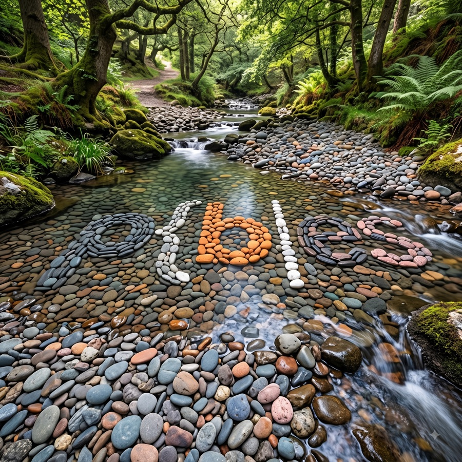

# p{b|es

<p align="center">
  
</p>

**Pebbles** is a self-hosted data platform — a data lake with time travel, multi-user
notebooks, drag-and-drop pipelines, dashboards, git integration, and a local AI
assistant — that turns hardware you already own into a Databricks alternative.
**$0 licence cost. No metered compute. No data leaves your network.**

One container image, one setup question ("is this the main, or an engine?"), and a small
team has a complete platform in under an hour — on **Docker, Podman, or LXC (Incus)**.

## How it works

- **One image, role at first boot** — `PEBBLES_ROLE=main` runs the control plane (Flask
  UI, Postgres catalog, jobs); `PEBBLES_ROLE=engine` runs compute. A single container is
  a complete product.
- **Engines, not clusters** — compute is DuckDB with DuckLake storage (Parquet files +
  Postgres catalog, snapshots with time travel). Scale by registering more engines.
- **UNIX accounts are the permission system** — every Pebbles user is a real host
  account; sessions, files, lake data, and jobs are all governed by uid/gid and
  filesystem permissions. There is no second ACL system.
- **`pebblesd` (Rust) is the only privileged component**; the UI is a React app
  served by a thin Flask tier that can only act through pebblesd's API.
- **Nkoyo**, the assistant, runs on local Ollama models, knows how Pebbles works
  (a built-in guide skill), and can create catalogs, schemas, notebooks and jobs with
  your approval. Skills install by name from git. Fully air-gapped operation is a
  hard requirement.

## Status

**Phase 0 (Foundation) complete.** A single container is a working mini data
platform on **Docker, rootful Podman, or Incus**: pebblesd (PID 1) supervises
Postgres and the web tier, users are real UNIX accounts signing in with their UNIX
password, sessions run as the user with memory admission control, and the lake is
live — DuckLake catalogs (Postgres metadata + Parquet data) with snapshot time
travel, a SQL editor, and results streaming over SSE. CI proves the acceptance
path on all three runtimes with zero network egress, and a nightly test proves
upgrades keep accounts, homes, and catalogs intact. **Phase 1 complete, Phase 2
underway**: engines register with single-use join tokens and serve sessions
brokered through the main; jobs compile to Airflow behind the scenes; Nkoyo (the
local-models assistant) chats and acts with per-turn tool approvals; and the
**UI is now the React workbench** from the design prototype — catalog browser
with time travel, SQL editor, notebooks, dashboards, files, jobs, and settings,
all served at `/` as a single-page app over the JSON API. Auto ETL is next. See
`HOWTO.md` to run what exists.

## Get the image

One image serves all three runtimes; CI builds it for **amd64 and arm64** and
the same tag resolves to the right architecture automatically. `:edge` tracks
the latest green commit on `main` (versioned tags arrive with v1.0.0).

```sh
docker login ghcr.io    # needed while the package is private
```

**Docker**
```sh
docker pull ghcr.io/djynnius/pebles:edge
```

**Podman** (rootful — required; rootless breaks the uid model and is refused)
```sh
sudo podman pull ghcr.io/djynnius/pebles:edge
```

**LXC (Incus)** — Incus consumes a converted artifact of the same image, built
by CI. Download `pebbles-incus-amd64` (or `-arm64`) from the latest
[Image workflow run](../../actions/workflows/image.yml), then:

```sh
echo "root:70000:5000" | sudo tee -a /etc/subuid /etc/subgid   # uid range delegation
sudo systemctl restart incus
incus image import metadata.tar.xz rootfs.tar.xz --alias pebbles
```

Or convert locally from the OCI image: `image/lxc/oci-to-incus.sh`.
See `HOWTO.md` for booting, first login, and the Incus profile (idmap + ports).

## Documents

| File | What it is |
|---|---|
| `pebbles-prd.md` | Product requirements (stable REQ/NFR IDs, priorities, phasing) |
| `pebbles-spec-v2.md` | Design & architecture spec — source of truth for UX and technical decisions |
| `pebbles-implementation-plan.md` | Stack, repo layout, runtime strategy, CI/CD, Phase 0 milestones |
| `ui_ux.html` | Interactive v15 prototype — source of truth for visual design (open in a browser) |
| `HOWTO.md` | What can be run right now, and how |
| `CHANGELOG.md` | Notable changes |

## License

MIT — see `LICENSE`. The image bundles third-party components (DuckDB, Airflow,
Postgres, the miniforge Python/R stack, and others) under their own licenses;
they are invoked as separate processes and retain their respective terms.
